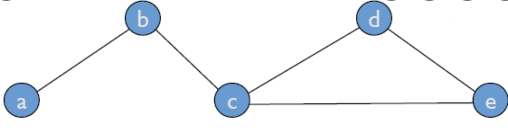

## 분산 대 탈 중앙화

- 일의 분산 대 일의 중복
- 동등 대 지배

### 디지털화의 효용 대 블록체인의 효용

- 블록체인을 잘못 이해한 사례

### 암호화폐, 가상화폐, 거래소 등

- 디지털 화폐 대 암호 화폐
- 암호 화폐 대 토큰
- 거래소 대 브로커, 중개소

### 디지털 자산

### 노드, 피어, 트랜잭션 등

### 트랜잭션

## 혼란의 시작 - 용어 정리

<aside>
💡 수학이 가장 많은 매력 중 하나는 모든 용어를 명확히 정의한 후 기호를 사용해 의사를 전달한다
→ 정보를 전달할 때 발생하는 혼란이 적고, 불필요한 오해는 사라진다

<aside>
💡 블록체인에서의 많은 논란의 주된 원인 또한 용어의 명확성이 결여돼 발생한다
→ 이런 혼란을 틈타 경제적 이익을 극대화 하는 세력들이 부추긴 바도 혼란의 원인으로 적지않다

## 분산 대 탈 중앙화

### 분산 시스템, 탈 중앙화 시스템

- 하나의 서버가 모든 일을 도맡아 처리하는 중앙 집중 시스템
- 복수 대의 서버가 일을 나눠 처리하는 분산 시스템
- 블록체인을 둘러싼 지금의 수많은 오해의 시작점
    - 분산 시스템과 탈 중앙화를 지향하는 블록체인의 근본적인 차이 이해 필요

- 블록체인을 ‘분산 시스템’이라 부르지 않고 ‘**탈 중앙화 시스템**' 이라 부르는 이유
    - 분산 시스템은 하나의 작업을 나누어 여러 복수의 서버가 처리하는 방식
        - **효율성과 서비스의 가용성을 높이는 것이 주목적**
    - 블록체인의 시스템은 각 서버가 하나의 동일한 작업을 할당받아 중복해 처리 하는 방식
        - **작업 결과의 신뢰도를 높인 시스템**

<aside>
💡 효율성은 분산 시스템이 더 높을 수 있지만, 작업이 끝난 이후에는 블록체인 시스템의 결과가 더욱 신뢰성이 높다. 블록체인, 분산시스템 모두 다른 목적을 두고 작동하는 별도의 시스템이다.
분산 시스템에선 분산이 핵심이라면, 블록체인에선 중복이 핵심이라 볼 수 있다
- 블록체인의 기본 목적과 용도가 일반적인 분산 시스템과는 확연히 구분 되기 때문

### 동등 대 지배

- 탈 중앙화의 또다른 특징
    - **네트워크에 속한 모든 노드가 동등**
- 특정역할을 담당하는 서버가 있는 시스템 : 통제 서버가 있는 분산 네트워크
- 네트워크내 모든 노드가 동등한 권리와 의무를 받는 시스템 : 탈 중앙화 네트워크

모든 노드의 동등성

- 특정 역할을 수행하는 서버가 없다는 것
- 간접적인 간섭을 통해 네트워크 사유화 하려는 시도로 부터 비교적 자유롭다
- 공격자의 입장에서 통제 서버가 없어 마땅히 확실한 목표가 사라짐
- 탈 중앙화가 훼손되어 몇몇 특정 서버가 생기면, 위 두가지 장점은 훼손될 수 있음
    - 일반적으로 특정서버가 생기는건 탈중앙화에선 금기시 되지만 거래소등이 간접적으로 이러한 특정서버의 역할을 간접적으로 수행 할 수 있음

## 디지털화의 효용 대 블록체인의 효용

### 블록체인에 대한 빈번한 오해

- 블록체인은 디지털화를 위한 도구가 아님
    - 블록체인은 일의 반복을 통해 효율성을 포기한 대신 신뢰가 존재하기 어려운 네트워크에서 신뢰할 수 있는 기록을 작성 할 수 있는 방법을 연구하는 분야 이다.

### 디지털화와 블록체인의 효용성 구분 방법

- 편의성과 안정성, 비밀보호, 업무 효율과 관계되있으면 디지털화와 관련
- 블록체인은 보안을 위한 도구가 아니라 ‘신뢰 받는 제삼자 없이 거래가 가능한 플랫폼’을 만들기 위한 실험적 연구

<aside>
💡 블록체인은 비밀성이 아닌 무결성을 향상시킨 시스템 이다.

### 블록체인의 대한 잘못된 이해 사례 반론

- 거래 비용 절감 : 채굴업자, 중개소 수수료 등의 비용이 들어가 기존 수수료 보다 배가 되는 비용이 지출됨
- 안전하고 편리한 데이터 활용 : 블록체인의 모든 데이터는 전체 노드에 그대로 노출, 중복을 통해 무결성을 유지 하므로 데이터의 갱신과 저장에 극도로 불편
- IoT와 연관 : 인공지능기술과는 다르게 블록체인과 연결성이 희미하여 의미 있다 보기 어려움

## 암호화폐, 가상화폐, 거래소 등

### 디지털 화폐대 암호화폐

- 디지털, 암호, 가상 화폐, 가상 통화 등과 용오거 명확한 구분없이 사용
- 화폐 : 돈과 같은 의미로 사용
- 통화
    - 유통 화폐의 줄임말
    - 여러 화폐 중 특별히 현재 통용되고 있는 것을 가리키는 법률적 용어, 가상 통화
- 디지털화폐 : 디지털 + 화폐를 합친 광범위한 단어
    - 유통화폐를 디지털화 했을때 사용
- 암호 화폐 : 실험적 가상 화페, 익명성을 보장하기 위한 기술이 들어간 것
    - 블록체인을 기반으로한 실험적인 화폐를 의미
- 암호화폐는 디지털 화폐와 같지 않음

- 암호화폐를 실생활에 통용되려면 다음과 같은 문제점의 해결이 필요함
    - 내가 받은 암호화폐가 진본인지 위조인지 구분이 가능해야함
    - 내가 받은 암호화폐가 이중으로 발급된것인지 아닌지 확인이 가능해야함
    - 내가 보유한 암호화폐의 소유권을 다른 사람들도 인정할 수 있는지
    
    → 기존의 화폐시장의 중앙통제시스템이 검증하고 보증하는 것을 할 수 있어야함
    
    다만, 중앙통제시스템의 경우 공격에 취약하다
    

### 암호 화폐 대 토큰

- 토큰 : 모든 종류의 보상을 통칭하는 광범위한 의미로 사용되는 것
- 토큰의 종류
    - 상품권, 명목화폐, 할인권
    - 감사하는 마음이나 칭찬 등과 같은 무형 행위도 포함이 가능

- 이더리움에서 사용되는 토큰
    - 통상적인 암호화폐 : 비트코인과 이더리움 처럼 자발적으로 네트워크 형성된 후 충분한 채굴자 집단을 구성해 지속적인 채굴 노동 제공을 해야 비로소 운영 할 수 있다
    - 또 다른 방법 으로는 이더리움의 스마트컨트랙트를 이용한 방법이 있다.
- 토큰
    - 자체 네트워크를 갖추지 않고, 스마트 컨트랙트를 활용해 발행된 암호 화폐
- 스마트 컨트랙트
    - 이더리움의 새로운 노드로서 참가하여서 암호화폐를 발행 할 수 있다
    - 이더리움 내의 네트워크를 활용한 스마트컨트랙트 vs 자체, 자발적 네트워크를 활용한 메인 넷 이 존재한다

### 거래소 대 브로커, 중개소

- 주식 거래소
    - 모든 매매 주문을 총괄하고 단일화해 하나의 통일된 가격으로 거래할 수 있도록 관리
- 암호화폐 거래소 : 암호화폐를 사고 파는 것을 중개해주는 브로커
    - 개별적으로 판매자 구매자 주문을 서로 중계해 연결 시켜주는 브로커 역할만함
- 증권거래소
    - 각 종목의 상장과 폐지를 법률이 정한 엄격한 규정에 의해 심사하고 관리
- 암호화폐 거래소
    - 오롯이 브로커들 스스로 저마다의 잣대로 판단하며, 그 선택에는 암호 화폐 개발자 등과의 깊은 유착이 작동할 수 있음
    
    → 따라서 정확한 명칭은 암호 화폐 중개소, 암호 화폐 브로커가 더 적합하다
    

## 디지털 자산

- 디지털 자산 : 디지털로 기록 보관 되어 있는 것들 중에서 실제로 권리 등의 가치를 가질 수 있는 것들
    - 예 : 디지털화된 책, 문서, 음원 그림 등 저작권 과 관련해 어떠한 가치가 있다고 믿을 수 있는 것에서 볼 수 있는 것

- 암호화폐는 디지털 자산과는 근본적으로 다르다
    - 암호화폐 : 이미 가지고 있는 무엇에 디지털 화를 한게 아니라 **가치를 갖고 있지 않는 것을 디지털 화한것에 불과함**
    - 암호화폐 내재 가치는 0, 가치를 가지려면 많은 사람들로 부터 신뢰를 가질 수 있어야 함
- 가치는 단순히 금전적 값어치와는 구분 되어야함
    - 금전적인 효용과, 긍정적이고 사회적인 효용도 갖추어야함
    - 암호 화폐는 익명성을 기반으로 두고 있어, 탈세, 범죄 수익 은닉, 돈 세탁, 시세 조정 등과 같은 온갖 폐해를 양산 하기에 디지털 자산으로 보기에는 시간이 필요할 것이다.
    

## 노드, 피어, 트랜잭션

---

- 네트워크를 그래프로 나타내면 각 컴퓨터, 서버는 꼭짓점(edge), 그것들 사이의 연결은 가지(branch)를 사용해 표현함
- 여기서 꼭짓점을 노드(node), 연결 가지를 피어(peer)라 한다

### 트랜잭션

- 금융 분야 : 모든 금융 거래를 폭넓게 의미
- IT 분야 : 데이터 베이스 작업에서의 쪼갤수 없는 최소한의 단위
- 블록체인 : 블록체인에서의 정의된 이벤트가 처리되는 것
    - 비트코인 이벤트 : 비트코인을 주고받는 거래
    - 이더리움 트랜잭션 : 이더리움을 주고 받거나 스마트 컨트랙트로 정의한 어떤 행위를 호출 하는것

<aside>
💡 비트코인에서는 주고받는 기록을 블록체인이므로 비트코인 에서의 거래 내역과 트랜잭션은 동일한 의미이다

