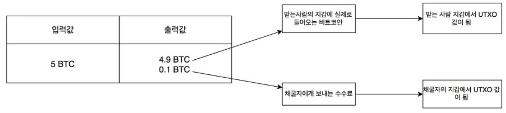

## 사이퍼펑크(CypherPunk)

- 1975년 DES(Data Encrypion Standard) 암호화 기술이 공개
- 사이퍼 펑크
    - 암호를 의미하는 사이퍼와 사이버상의 악동을 의미하는 사이버펑크의 합성어
    - 암호화 기술을 활용해 개인의 프라이버시 보호를 극대화하려 했던 행동주의자
- 1990년대 초반 사이퍼펑크 본격화
    - 데이비드 차움 : 암호학을 화폐에서 부터 투표까지 다양한 영역에서 활용한 혁신적 연구 논문 저자로 현대 암호학의 대부
    - 1981년 논문 <추적 불가능한 전자메일, 반송주소와 디지털 서명>
    - 1982년 가상화폐 디지캐시(DigiCash)를 제안하는 백서에서 은닉서명 이라는 개념 소개
    - 1983년 발표한 E-Cash
        - 금융 거래를 암호화해 개인의 프라이버시를 보호하려한 최초의 기술 개념, 사이퍼 펑크가 활성화 되는 계기가 됨
    - 1985년 발표한 논문 : <신분 노출이 없는 보안 : 빅브라더를 이기는 방법>
        - 사이퍼펑크 운동의 중요한 사상적 배경이 됨

- 익명성을 가진 결재수단이 야기할 수 있는 부작용
    - 통제와 안전을 결여하고 있으므로, 도난이나 블랙마켓 뇌물 탈세등에 이용될 수 있음

- 데이비드 차움은 이러한 결제의 **익명성을 가진 수단**은 다음의 성질을 만족해야함
    - 각 개인이 행한 결재에 대해 수취인, 결재 시간, 금액에 대해 제 삼자는 알 수 없어야 한다
    - 각 개인은 예외적 상황에서는 그 결재에 대한 증명 또는 수취인의 신원에 대한 자료를 제공할 수 있어야 한다
    - 도난 당한 것으로 보고된 결제 수단에 대해서는 사용을 중지할 수 있어야 한다

<aside>
💡 이러한 방식의 익명성을 슈도니머스라고 하며, 이것이 아닌 비트코인의 익명성은 어나니머스라 한다. 근본적인 차이는 평상시에는 익명을 유지하지만 유사시에는 정체를 밝힐 수 있는지 여부이다.

### 비트코인의 탄생 (2009년 1월)

- 2008년 새로운 결제수단의 논문이 사토시 나카모토 라는 가명으로 암호화 커뮤니티에 메일로 발송함
- 논문명 : 비트코인 P2P 전자 캐시 시스템
    - 비트코인을 그 누구의 간섭이 없는 결제 수단이라 설명
    - 통제와 안전마저도 완전히 벗어 던진 절대 익명성을 가진 것

- 이더리움은 비트코인 탄생 이후 6년 7 개월이 지난 2015년 7월 30일 가동 시작
    - 이더리움 비탈릭 부테린이 창안한 퍼블릭 블록체인플랫폼 이자 이 플랫폼의 자체 통화 이름
    - 이더리움의 화폐 단위 : 웨이, 사보, 피니
    - 1이더 = 1018웨이 = 100만 사보 = 1000피니

- 비트코인과 이더리움의 큰 차이는 적용 범위
    - 비트코인 : 결제나 거래 관련 시스템, 화폐 로서의 기능에 집중
    - 이더리움 : 핵심 기술인 블록체인을 기반으로 거래나 결제 뿐 아니라 계약서, SNS, 이메일, 전자 투표 등 다양한 어플리케이션을 투명하게 운영할 수 있게 확장성을 제공

- 비트코인 최대 생산량 : 2100만 코인
  
    → 사람들이 평균 10분당 1개의 비트코인이 생성되도록 난이도를 조절한다.
    
- 블록체인 이라는 고유명사
    - 2008년 공개된 논문에서는 블록체인이란 고유명사가 없었다.
- 블록
    - 비트코인에서의 블록은 거래 내약에 관한 데이터가 담기는데 블록당 1메가바이트를 못넘긴다
- 체인
    - 블록들이 생성된 시간 순서에 맞춰 차례로 정렬한 후 마치 쇠사슬 처럼 놓여진것
- 블록체인 : 네트워크에서의 생성된 모든데이터를 중앙서버의 통제 없이도 발생 순서대로 정렬할 수 있는 방법을 연구해낸것

## 블록체인의 기본 동작 원리

- 블록한개 → 거래 원장 특정페이지
- 블록체인 데이터 → 거래 원장 책

<aside>
💡 블록하나당 하나의 거래 내역이 저장되며 블록의 묶음인 블록체인 데이터를 통해 책의 형태처럼 전체 거래원장을 확인할 수 있다.

- 비트코인 시스템에서의 데이터조회
    - 모든 개별적 참여자가 모든 데이터를 로컬환경에 보관하고 있는 모습을 볼 수 있다
    - 제네시스 블록부터 현재까지의 모든 트랜잭션 데이터는 개인별로 별도 저장되어 있으므로, 거래 내역을 살펴보는 것은 서버에 요청하지 않고, 로컬에 저장된 데이터를 조회하는 방식을 의미한다

- 완전 노드와 단순 지급 검증 노드
    - 탈중앙화 시스템의 일반적인 철학 : 전체 노드가 동등한 위치에서 같은 의무와 권리를 가지고 동등한 역할을 수행하는 것
    - 현실적으로 방대한 블록체인 데이터를 모든 노드가 저장하는 것에는 많은 무리가 따른다
    - 전체 블록체인 데이터를 받는 것은 쉬운 작업이 아니기에 비트코인 노드를 설계할 때 완전 노드(full node)와 단순 지급 검증 노드(SPV, Simplifired Payment Verificaation)형태를 두었다
        - 완전노드 : 전체 블록체인 데이터를 완전히 다운로드해 저장하고 있는 노드, 모든 블록체인의 이체 내역 퍼블릭 키, 해시 등등 필요한 모든 것을 저장하고 이를 통해 확실하게 기록 검증이 가능
        - 단순 지급 검증 노드 : 최소한의 정보만 다운로드하고 있는 노드, 이체 내역의 검증만 가능한 블록 헤더만 저장한 노드
    - [bitcoing.org](http://bitcoing.org) 에서 권장하는 완전 노드 최소 컴퓨터 사양
        - 최신 버전의 운영체제를 갖춘 데스크톱, 랩톱
        - 200기가바이트 이상의 공간
        - 1기가 이상의 메인메모리
        - 업로드 속도가 초당 400킬로 이상인 인터넷 환경
        - 하루 최소 6시간 이상 로그인
    
- 블록체인의 작동방식
    - 중압집중형
        - A → B 입금 시도시, A와 중앙시스템만 트랜잭션에 참여
    - 탈중앙화 시스템
        - A → B 입금 시도시, A를 포함한 모든 노드가 트랜잭션에 참여
        - 누가 처리할지 알수 없기 때문에 모든 내역서 내용을 전체노드에 알림
        → (브로드캐스팅, 가십 프로토콜)

- **브로드캐스팅을 통한 전달**
    - 먼저 보냈다고 먼저처리 되는 방식이 아니다
        - 각 노드 환경에 따라 대기실에 순서 구성이 다르게 저장되어있다
        - 따라서, 시간이 아닌, 높은 수수료를 기준으로 처리된다.
    
    - 가장 먼저 해쉬 퍼즐을 푼 노드가 리더로 선출된다
        - 리더는 대기열에 쌓여있던 거래 내역을 블록에 기록하는 역할을 담당함
          
            → 선출된 리더 의 검증은 (희망하는)모든 노드가 참여하여 검증을 한다
            
            → 무결성 검증에서 이 노드가 정말 리더인지 확인 과정을 갖는다
            
            → 조작되었는지 여부를 확인하는떄 이때 해시함수, 전자서명, 비대칭 암호화 기법이 사용된다
            
            → 이때 검증의 참여한 노드중 51퍼센트 이상이 승인한 노드를 검증되었다 정의한다
            
            → 만약 검증되지 못한 경우 그 블록은 폐기되어 블록체인 데이터에는 변화는 없다
            
    
    - 리더 선출 합의과정 : 작업증명 (PoW), 지분증명 (PoS)
        - 작업증명 : 해시 값을 찾아 작업을 진행하여 리더를 선출하는 방식의 알고리즘
        - 지분증명 : 작업증명에서의 단점인 하드웨어 스펙과 관계 없이 지분이 많은 노드가 확률이 높게 리더가 될 수 있는 방식의 알고리즘
        
    
    
    
    ### 비동기화 시스템에서의 탈중앙화 합의
    
    - 블록체인은 완전한 비동기화 시스템
        - 모든 동작을 지시하고 정해진 순서와 시각에 전달받은 신호에 맞춰 작동시킬 중앙서버가 없기 때문
        - 전체 네트워크에 현재 몇 개의 노드가 있는지, 어디에 있는지, 어떤 성질을 갖고 있는지 전혀 알 수 없다
        - 오로지 현재 내가 갖고 있는 데이터와 피어를 통해 방금 전달받은 정보를 통해 그 다음 단계를 수행할 수 밖에 없다
        
    - 리더가 동시의 선출된 경우
        - 동일한 네트워크에서 서로 다른 블록체인이 자랄 수 있다.
            - 이런 데이터 충돌이 발생 했을때는 통합하는 결정규칙을 따른다
                - 결정규칙 : 비교후 검증이 완료된 블록체인중 길이가 제일긴 블록체인을 채택하여 최종 블록체인 원장에 반영한다
            
            <aside>
            💡 블록의 깊이는 블록의 안정성과 직결된다.
            
            
            

|  | 변동성 | 설명 |
| --- | --- | --- |
| 블록 깊이 | 항상 변화, 지속적 증가 | 가장 최근 블록이 깊이가 1이 되고, 블록이 추가될 수록 1씩 증가. 확인이라고 부름 |
| 블록 높이 | 변화 없음, 고정 | 제네시스 블록이 0이 되고, 그 이후로 블록이 생성될 때마다 1씩 증가돼 블록이 언제 생성됐는지 순서를 알 수 있음 |
| 블록 해시 | 변화 없음, 고정 | 그 블록만의 고유한 주소이며, 32바이트 된 해시 값 |

### 블록의 구조

| 4바이트 : 블록 크기 |
| --- |
| 80바이트 : 블록 헤더 |
| (1~ 9 바이트 가변 크기)
블록 내 전체 거래 내역 개수 |
| 가변 크기 : 블록 내 모든 거래 내역 |
- 블록체인에 속한 블록 하나당 구조는 위처럼 구성되어 있다
- 블록은 1메가 바이트로 제한되어있다
- 1~ 3번째 까지의 블록데이터는 최대로 닮길 수 있지만
- 마지막 전체 트랜잭션에 경우 크기가 제한 될 수 있다. (이때 트랜잭션은 잘려서 저장될 수 없기 때문에)

### **블록 헤더 구조**

| 4바이트 : 버전 |
| --- |
| 32바이트 : 이전 블록 해시 |
| 32바이트 : 머클트리 루트 해시 |
| 4바이트 : 타임 스탬프 |
| 4바이트 : 타깃 난이도 비트 |
| 4바이트 : 난스 |
- 총 80 바이트의 블록헤더는 위의 구조로 되어 있다.

### **트랜잭션 구조**

- 트랙잭션
    - 수록정보
        - 송신인의 공개키 값
        - 수신인의 비트코인 주소
        - 전송하려는 비트코인 금액
        - 송신자의 전자 서명
        - 송신인이 지출하려는 비트코인의 출처

- 트랜잭션 UTXO
    - 비트코인 수령 이후, 아직 사용하지 않은 상태로 블록에 남아 있는 항목을 말함
    
    → 우리가 아는 블록체인 지갑 소프트웨어들은 각 블록에 흩어진 UTXO 정보를 가져와 잔고를 표시함
    
- 트랜잭션 - 코인베이스
    - 모든 블록의 첫 번째 트랜잭션은 그 블록을 채굴한 사람에게 보상금을 지급해주는 트랜잭션
    - 코인베이스 트랜잭션 : 블록의 보상금을 지급하는 트랜잭션
    - 코인베이스 트랜잭션을 제외한 모든거래는 ‘일반 트랜잭션’

<aside>
💡 코인베이스 트랜잭션은 우리의 지폐로 치면 지폐 발생처이며 블록체인에선 처음의 채굴보상을 받은 트랜잭션을 말한다. 보상 지급 트랜잭션이므로 이전 출력이 존재하지 않는다.

→ 동시의 코인베이스 트랜잭션을 생성하여 2명 이상의 채굴자가 중복보상을 받는 경우 합의 과정을 통해 1개만 채택하며, 나머지는 무효처리 된다. 이때 코인베이스 이후의 생성된 트랜잭션은 대기실로 넘어가 지연처리 되며, 혼란을 방지하기 위해 코인베이스 트랜잭션 보상은 시간이 지난 이후에 사용이 가능하다

### 스마트 컨트랙트

[https://www.notion.so](https://www.notion.so)

- 스마트 컨트랙트 : 적절한 프로그래밍을 통해 스스로 수행하는 계약

- 비트코인 지갑
    - 비트코인을 사용하기 위해 필요한 최소한의 응용 프로그램
    - 설치하면, 비트코인 네트워크에 접속할 수 있고, 비트코인의 거래가 가능
    
    <aside>
    💡 비트코인 지갑은 단순히 사용자의 편의를 위해 논리적으로 합산한 총액을 프로그램에 표시 하는 역할만 할 뿐, 실제로 잔액은 각 블록에 분산되어 저장되어 있다. 이를 어느 블록의 잔액을 사용할 지는 지갑이 적절히 판단하여 사용함
    
    
    
- 비트코인 지갑의 주요 역할 세 가지
    - 계정 관리를 위한 개인/공개키 생성 및 관리
        - 비트코인은 비트코인 주소를 이용해 거래
        - 비트코인 주소에는 계정의 소유자를 증명해줄 수 있는 공개 암호키의 해시정보가 있다
        - 비트코인 지갑을 설치하면 사용자를 위한 2개의 암호키 생성 (비대칭 암호기법의 공개키, 개인키)
    - 비트코인 거래를 시스템에 제출
        - 은행의 콜센터 역할을 하는 곳이 없으므로, 개인키를 도난 당할 경우 해결할 수 있는 방법이 없음
    - 비트코인 주소 생성 및 비트코인 잔액 관리
        - 다양한 백업 방법, 손쉬운 비트코인 주소 변경