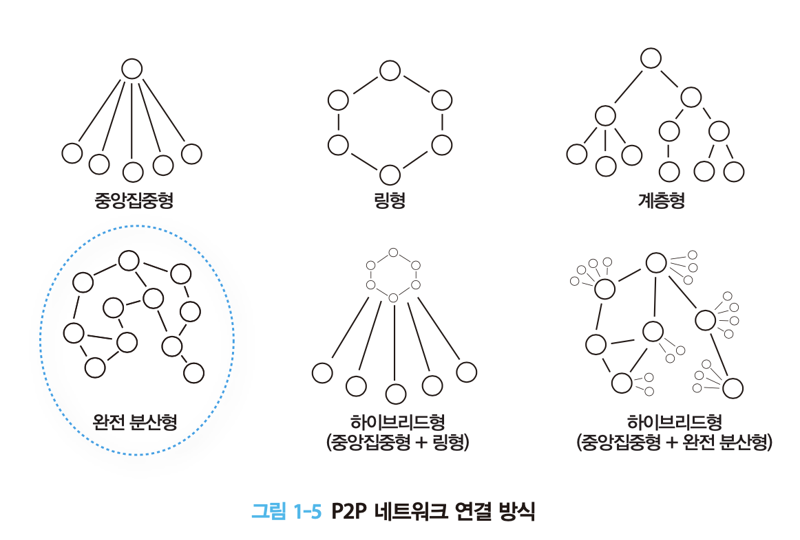
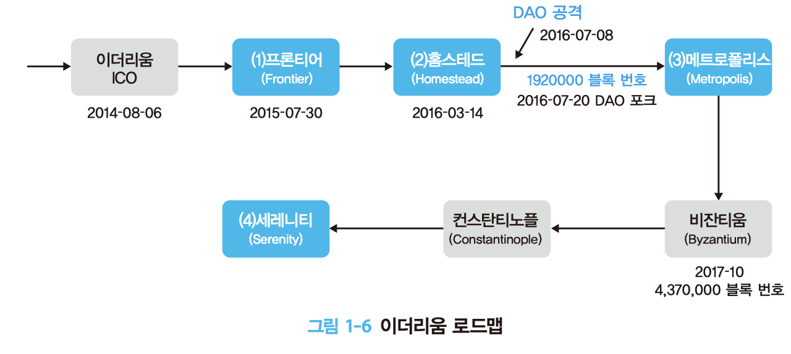

## 알트코인

- 알트코인은 초기의 비트코인 프로토콜을 수정하여 개발되었기 때문에 비트코인과는 호환되지 않는다.
- 현재에 와선 비트코인을 제외한 암호화폐를 지칭하는 용어로 사용된다
    - 예) 리플, 라이트코인, 대시, NEM, 이더리움 클래식, 비트코인 캐시, 모네로 등

### 비잔티움 장군 문제

<aside>
💡 비잔티움 제국에 다섯 명의 장군이 있었다. 이들은 서로 사이가좋지 않아 믿을 수 없는 사이였다. 어느 날 황제가 장군들에게 비잔티움 성을 점령하라고 명령을 내렸고, 장군들은 고생 끝에 비잔티움 성을 포위하는 데 성공하였다. 그런데 비잔티움 성에는 1,000여 명의 병사들이 수비를 하고 있었다. 다섯 명의 장군은 각기 300명의 병사들을 이끌고 있었기에 성을 포위하고 있는 다섯 장군이 동시에 공격해야만 승리할 수 있었다. 그런데 다섯 명의 장군이 지리적으로 떨어져 있어 연락병을 통해서만 연락할 수 있었고, 서로 사이가 좋지 않다 보니 서로 믿을 수 없는 상황이었다. 만약 장군 A가 장군 B에게 저녁 11시에 기습 공격을 하자고 전하고 다시 장군 B가 장군 C에게 전달했는데, 장군 C가 배신을 해서 장군 D에게 거짓 시간을 알려주고 장군 D가 다시 이 거짓 정보를 장군 E에게 전달하는 상황이 발생했다고 하자. 장군 D와 E가 공격에 함께 참여하지 못해 결국에는 비잔티움 점령에 실패할 것이다. 과연 어떻게 해야 서로 신뢰할 수 없는 장군들이 정해진 시간에 함께 공격할 것인가? 이문제를 풀려면 어떤 방법으로 소통할지, 신뢰할 만한 장군들이 몇 명이 필요한지 결정하는 것이 필요하다.

- 비트코인은 이러한 문제를 해결하기위해 트랜잭션 정보를 모아 블록을 만들고 이 블록을 시간순서로 연결한 공유 원장 기술인 블록체인 고안하여 위변조가 불가능 하도록 만들었다.

### P2P 네트워크

---

- 중앙집중형
    - 서버 클라이언트 네트워크 구조
        - 서버가 전체 네트워크를 관리, 통제, 유지하고 클라이언트에게 서비스를 제공하는 방식
- P2P 네트워크
    - 중앙집중 시스템 없이 각 노드가 동등한 계층에서 서로 통신하는 것

- 이더리움의 경우 완전 분산형 방법을 사용한다.
    - 참여한 모든 노드가 동등한 권한과 권리를 갖고 이더리움 네트워크에 참여하는 것을 기본 철학으로 갖기 때문이다.
    
- 장점
    - 누구나 네트워크에 참여가 가능해 확장성이 좋다
    - 노드들이 모두 연결되어있어 일부 노드에 대한 문제에 안전하다
    - 관리 감독기능이 별도로 없기 때문에 책임의 문제가 없다
- 단점
    - 동등한 권한의 노드들로 구성되있어 관리가 어렵다
    - 연결한 노드가 안전한지 검증하기 어렵기 때문에 신뢰성이 떨어진다
    - 노드마다 컴퓨팅 파워, 네트워크 속도가 다르기 때문에 전체 성능에 영향을 미친다

### 이더리움

---

- 프론티어 : 이더리움을 개발 및 채굴하고 네트워크를 형성하는 단계
- 홈 스테드 : 이더리움에 노드들이 생기면서 생태계가 구축되는 초기단계
- 메트로폴리스 : 이더리움의 대중화를 위한 인프라가 형성되는 단계
- 세레니티 : 모든 변화후 평정을 찾는 마지막 단계

<aside>
💡 2016년 7월 8일 DAO 공격이 발생해 하드포크 진행하여, 이더리움 클래식이 등장했다

### 프라이빗 블록체인

---

- 참여 대상을 미리 정하고 이들의 권한을 제어할 수 있는 블록체인

- 프라이빗 채널
    - 해당 거래의 참여자가 아닌 경우 거래 내용을 공개하지 않고, 관련된 참여자 끼리 프라이빛 채널을 통해 거래 내용을 공유
- 권한이 다른 노드들
    - 사업의 특성상 처리 과정을 관리 감독하거나 권한을 부여하는 등 특정 권한을 갖는 노드가 필요함
- 빠른 처리 속도와 높은 처리량
    - 은행이나 주식 거래, 티켓 예매 같은 거래를 처리하기 위해서는 높은 거래 처리 용량과 빠른 처리속도가 필요
- 스마트 컨트랙트
    - 중간 거래자 없이 거래를 처리하기 위해서는 유연한 스마트컨트랙트 기능이 필요
- 시스템 커스터마이징
    - 다양한 기업에 환경에 맞도록 블록체인 전체 엔진을 커스터마이징할 수 있어야 한다

### 비트코인 네트워크

---

- 비트코인에서 사용하는 블록체인 네트워크

- 구성원
    - 풀 블록체인 노드
    - 채굴자 노드
    - Lightweight(SPV) 노드 스마트 기기
    - 서드파티 API 클라이언트
- 기본적으로 모든 노드는 트랜잭션 내용을 확인 검증하는 것을 수행
- 송금 내용을 모아 승인하는 절차는 채굴자 노드가 진행
- 채굴자 노드의 승인이 완료된 트랜잭션들을 모아 블록을 생성하고 네트워크로 전파
- 생성한 블록을 기존 블록에 체인으로 연결하여 블록체인으로 관리하는 절차는 모든노드가 진행
- 풀노드가 관리하는 블록체인에는 모든 트랜잭션 내역이 저장된다.