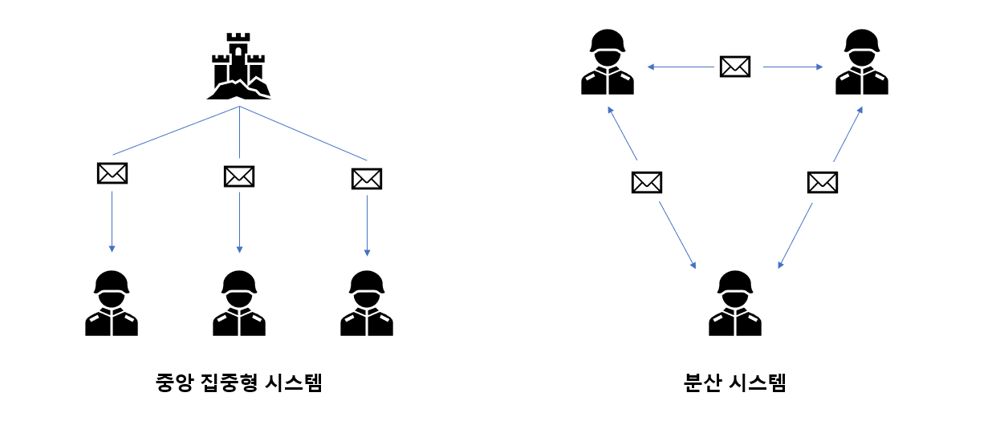

## 하드포크와 소프트포크

---

- 비트코인의 경우 첫 제네시스 블록이 생성된 이후 2018년 12월 까지 모두 22번의 소프트웨어가 변경되었다
- 비트코인은 여전히 베타버전이여서 탈중앙화 시스템의 유지보수의 어려움 이라는 단점을 특히 부각 시킨다.
  - 중앙 시스템이 없기에 모든 노드가 최신 버전으로 갱신하는 것은 어렵다
  - 이를 해결하기 위해서 탈중앙화 시스템은 중앙시스템과 다른 방식의 과정을 거친다.

- 실질적으로 모든 노드가 동시에 업그레이드 하는것은 불가능
  - 업데이트한 노드와 하지 않은 노드와의 규칙차이로 인한 충돌 발생

- 충돌을 야기하는 규칙 변화
  → 이로인해 각 규칙변경 방식에 따라 그룹이 인정하는 블록생성 범위차이 발생
   - 과거의 무효화된 규칙을 유효화 하는 경우 : **하드포크**
     - 최신 규칙을 따르는 집단이 훨씬 다양한 블록 생성

   - 과거의 유효화된 규칙을 무효화 하는 경우 : **소프트포크**
     - 과거의 소프트웨어를 사용하는 집단이 생산하는 블록의 범위가 훨씬 넓음

### 하드포크(Hard Fork)

---

- 과거에는 무효하던 규칙을 유효로 변경하는 변화가 일어나 모든 노드가 새로운 시스템으로 변경해야만 블록체인 데이터가 통일 되는 경우

<aside>
💡 하드포크가 진행된 이후 이전버전의 방식은 더이상 지원을 하지 않는다
필수적으로 적용되어야만 하는 업데이트 등에서 사용된다

### 소프트포크(Soft Fork)

---

- 과거에는 유효하던 규칙을 무효로 변경하는 변화가 일어나 다수의 노드가 새로운 규칙을 따르게 되었을때 모두 새규칙을 따르게 되는 경우
- 사용자 활성화 소프트포크(UASF)
  - 채굴자들에게 의존하지 않고 완전노드의 의견에만 의존하여 소프트포크를 진행하는 방식
- 채굴업자 활성화 소프트포크(MASF)
  - 채굴자들의 의견에 의존해 소프트포크를 진행하는 방식

<aside>
💡 소프트포크가 진행된 이후 이전버전의 방식도 여전히 지원을 할 수 있다.
사용자들의 동의가 필요해서 업데이트가 적용되지 않을 수도 있다.

### 세그윗, 세그윗 2x

---

- 하드포크를 하지 않고도 무효하던 규칙을 유효화 하는 아이디어
- 세그윗 : 소프트포크를 이용하여 하드포크 효과를 줄 수 있는 방안
  - 입력에 있는 전자서명과 공개키 값 부분을 완전히 분리한 후 기존의 1메가바이트 블록 영약 밖의 새로운 데이터 구조 영역으로 옮긴다는 아이디어
- 세그윗 2x : 하드포크를 무릅 쓰더라도 하루빨리 블록의 용량을 확대하자는 주장

<aside>
💡 **세그윗**이란 Segregated Witness의 약자로서, [비트코인](http://wiki.hash.kr/index.php/%EB%B9%84%ED%8A%B8%EC%BD%94%EC%9D%B8)의 [블록](http://wiki.hash.kr/index.php/%EB%B8%94%EB%A1%9D)에서 디지털 서명 부분을 분리함으로써 블록당 저장 용량을 늘리는 소프트웨어 업그레이드를 말한다.

### 51% 공격

---

- 비트코인 시스템은 리더로 선정된 노드의 의해 지배된다.

- 이 리더를 뽑기위해 해시퍼즐을 푸는데, 이를 푸는 계산 능력을 해시 파워라 부른다

  → 극단적인 상황으로, 이러한 리더를 선출하는 과정에서 51% 이상의 해시 파워를 가진 집단이 비트코인 시스템을 지배하게 되는 것을 말한다.

- 현실적으로 일어날 가능성이 높지 않은 이유

  - 51% 공격을 위해 하드웨어 등에 막대한 투자를 해야하는데 투자 규모에 비해 시스템을 장악후 얻는 이득이 적음
  - 공격을 감행할 정도의 해시 파워를 가직 세력은 대부분 대형 채굴업자, 기존에 채굴한 암호화폐를 가장 많이 보유하고 있는 큰손들

- 만일 생산권을 독접한 세력이 이를 시스템 규칙 장악에 사용하게 되면 심각한 문제가 야기된다

## 비잔틴 장군 문제와 블록체인

분산시스템 : 여러 서버에서 일을 나누어 하는것으로 작업의 효율을 꾀함

- 여러 곳에 분산된 서버가 항상 동일한 상태를 유지할 필요 있음
- 다양한 오류 상황을 극복하고 동일한 상태를 유지하게 만드는 방법을 찾는일은 어려울 것이다

분산된 서버들의 상태를 일치 시키는 방법

- 가장 간단한 모델 : 고장-중단 모델
- 가장 힘든 궁극의 모델 : 블록체인과 같은 비잔틴 장군 모델
- 연구과제 : 네트워크를 구선하는 N개 노드 중 m 개의 노드가 고장 되었을 때
  - 여전히 서로 상태를 일치시킬 수 있을 것인지를 알아내는 것
  - 상태 일치가 가능한 최대 m값이 얼마인가
  - 그때의 일치시키는 알고리즘은 어떤 것이 최적인가

### 고장-중단 모델

- 네트워크를 구성하고 있는 각 노드가 가질 수 있는 상태
  - 정상적으로 작동
  - 고장으로 인해 멈추는 것
- 이 모델에서의 함의
  - 단순히 고장 난 노드를 네트워크에서 제거
  - 단하나의 노드라도 정상적으로 동작하면 언제든 합의에 이르게 됨
- 현실의 네트워크 환경은 이보다 훨씬 혹독, 고장-중단 모델은 설명의 편의를 위한 이론상의 환경일 뿐

<aside>
💡 P2P 환경등의 경우 노드가 모두 연결되어 있는 구조가 아니고, 이 때문에 고장여부를 확인하기 위한 과정이 불가능에 가깝다. 따라서, 고장-중단 모델은 현실적으로 어렵다.

### 비잔틴 장군 모델

- 누가 어떤식으로 메시지를 왜곡 하느냐에 따라 각 장군들은 다른 정보를 전달받게 됨, 따라서 서로 하나의 통일된 메시지로 합의 할 수 있는 방법을 찾아야 하는 모델

<aside>
💡 중앙 집중형 시스템에서 각자에게 메시지를 보내는 방식이 아닌 각자가 각자에게 서명된 메시지를 주고 나눠 서로의 내용을 확인하고 검증하는 모델이다

### 블록체인과 보안

- 비트코인과 블로체인의 혼동으로 인해 블록체인과는 관계 없는 중개소의 안정성을 블록체인의 안정성과 착각하는 경우가 있다.
- (비트코인 시스템 > 블록체인) ↔ 비트코인 지갑 ↔ 중개소, 기타 응용프로그램
- 의 구조를 가지고 있다

- 블록체인은 내재적 안정성
- 비트코인 시스템에선 응용적 안전성
- 비트코인 지갑에선 개별적 안전성을 봐야한다
  → 중개소에선 외재적 안전성을 봐야한다

- 비트코인 시스템 - 내재적 안정성
  - 블록체인은 보안도구로 착각하는게 아닌, 분산과 연쇄 해시 라는 보안 관련 성질을 사용하고 있을 뿐
  - 연쇄 해시 등이 블록 체인을 의미하는 것은 아니다
  - 내부 데이터 자체는 다 공개되어 있기 때문에 우리가 아는 그런 보안성과는 다른 의미를 가지고 있다

- 비트코인 시스템 - 응용적 안정성
  - 비트코인 시스템은 암호화폐 분야에 특정하여 만들어진 응용프로그램이다.
    → 따라서 화폐 거래외에 새롭게 내린 정의에 따라 사용할대 부가적인 안전 문제가 추가로 발생할 수 있다.
  - 탈중앙화 시스템인 만큼 소프트웨어 업데이트등의 유지보수는 사용자의 자발적 참여로 진행되는데 이는 중앙시스템과 같은 유연성을 가지지 못해 수정까지의 시간이 길어지게 된다
    → 이로인해 제로데이어택 과 같은 긴급한 취약점이 발견될 경우 치명적이 될 수 있다.

- 비트코인 시스템 - 기본 설계 안정성
  - 블록체인에선 해시값을 가지지만 비트코인의 해시퍼즐을 이용한 작업증명관련은 가지지 않는다.
    → 해시퍼즐과 난이도 조절에 관한 결함은 블록체인의 결함이라기보단 작업증명을 채용하는 비트코인 시스템의 문제이다
  - 해시 퍼즐과 난이도 조절의 결함
  - 2017년도 부터 상위 10개 업체의 채굴 점유율은 90퍼센트에 육박하게되었는데, 이는 대부분 중국업체가 담당하고 있다.
    → 이로인해 비트코인 모든 블록생성에 관한걸 불과 10개업체가 담당하는 구조가 되어 기존 은행과 다를바 없는 구조가 되었다

- 비트코인 지갑 - 개별적 안정성
  - 지갑 소프트웨어 자체 문제
    - 회사마다 비트코인 지갑의 안정성이 다 다르기 때문에 발생
  - 지갑 사용자의 문제
    - 사용자의 부주의로 인한 암호키 누출, 분실등의 문제

- 중개소 등 외부 환경 - 외재적 안정성
  - 사용자는 중개소를 통해 암호화폐 매매과정을 진행하게되면 암호화폐를 사용하는 착각을 가질 수 있지만 현실로는 중개소와 시중 은행간 현금이 오갈 뿐이고 중개소, 비트코인 시스템간 현금 유통자체는 존재하지 않는다