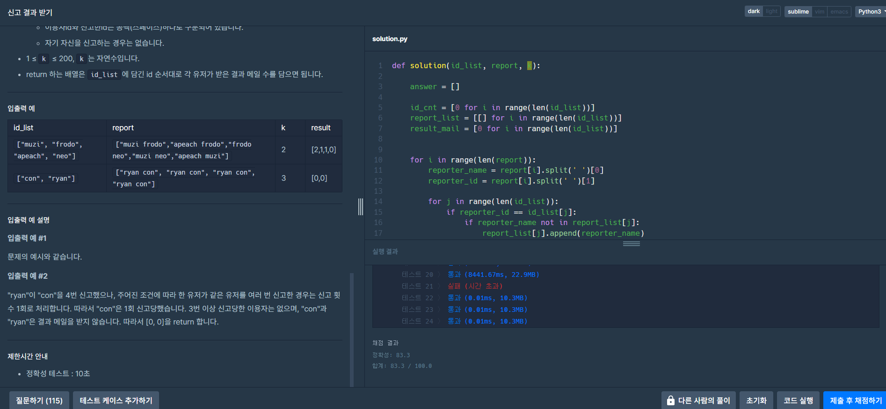

### 문제 설명

[코딩테스트 연습 - 신고 결과 받기](https://school.programmers.co.kr/learn/courses/30/lessons/92334)

신입사원 무지는 게시판 불량 이용자를 신고하고 처리 결과를 메일로 발송하는 시스템을 개발하려 합니다. 무지가 개발하려는 시스템은 다음과 같습니다.

- 각 유저는 한 번에 한 명의 유저를 신고할 수 있습니다.
    - 신고 횟수에 제한은 없습니다. 서로 다른 유저를 계속해서 신고할 수 있습니다.
    - 한 유저를 여러 번 신고할 수도 있지만, 동일한 유저에 대한 신고 횟수는 1회로 처리됩니다.
    
- k번 이상 신고된 유저는 게시판 이용이 정지되며, 해당 유저를 신고한 모든 유저에게 정지 사실을 메일로 발송합니다.
    - 유저가 신고한 모든 내용을 취합하여 마지막에 한꺼번에 게시판 이용 정지를 시키면서 정지 메일을 발송합니다.
    
      

### 제한사항

- 2 ≤ `id_list`의 길이 ≤ 1,000
    - 1 ≤ `id_list`의 원소 길이 ≤ 10
    - `id_list`의 원소는 이용자의 id를 나타내는 문자열이며 알파벳 소문자로만 이루어져 있습니다.
    - `id_list`에는 같은 아이디가 중복해서 들어있지 않습니다.
- 1 ≤ `report`의 길이 ≤ 200,000
    - 3 ≤ `report`의 원소 길이 ≤ 21
    - `report`의 원소는 "이용자id 신고한id"형태의 문자열입니다.
    - 예를 들어 "muzi frodo"의 경우 "muzi"가 "frodo"를 신고했다는 의미입니다.
    - id는 알파벳 소문자로만 이루어져 있습니다.
    - 이용자id와 신고한id는 공백(스페이스)하나로 구분되어 있습니다.
    - 자기 자신을 신고하는 경우는 없습니다.
- 1 ≤ `k` ≤ 200, `k`는 자연수입니다.
- return 하는 배열은 `id_list`에 담긴 id 순서대로 각 유저가 받은 결과 메일 수를 담으면 됩니다.


### 제한시간 안내

- 정확성 테스트 : 10초


## 풀이 과정

```python
def solution(id_list, report, k):

    answer = []

    id_warning_cnt = [0 for i in range(len(id_list))]      # 신고누적
    report_list = [[] for i in range(len(id_list))]        # 신고자
    result_mail = [0 for i in range(len(id_list))]         # 결과 메일

    
    for i in range(len(report)):
        reporter_name = report[i].split(' ')[0]         
        reporter_id = report[i].split(' ')[1]         

        for j in range(len(id_list)):
            if reporter_id == id_list[j]:               
                if reporter_name not in report_list[j]:    
                    report_list[j].append(reporter_name)   
                    id_warning_cnt[j] += 1    # 다음인덱스               

    
    tmp_list_mail = []
    for i in range(len(id_list)):
        if id_warning_cnt[i] >= k:
            tmp_list_mail = tmp_list_mail + report_list[i]

    for i in range(len(tmp_list_mail )):
        for j in range(len(id_list)):
            if tmp_list_mail [i] == id_list[j]:          
                result_mail[j] += 1

    answer = result_mail

    return answer
```

- 받은 id_list, report 값에 길이에 따라 처리하는데 사용할 배열들을 초기화
- 2중 4문과 if 문을 사용, 배열을 이용해서 처리를 했다.
- 인자로 받아온 신고자 이름, id 값을 split 해 변수에 저장
- id_list 값을 순차탐색을 하여 신고 여부, 중복 신고 여부를 확인해서
- 신고누적 분기값인 k 값을 기준으로 제재 대상을 임시 메일 리스트에 저장
- 임시 메일 리스트 값에 신고 접수 건들을 일일이  세면서,  결과메일 갯수를 result 메일에 저장
- 처리결과 메일 횟수 리스트를 리턴


### 결과



- 이전과 마찬가지로 작동은 되나, 시간초과 문제가 발생


## 문제점 탐색, 재풀이

- 가장 가까운 시간초과 문제는 리스트를 일일히 for문을 통해 순차탐색을 하는것이 문제인듯 하다
- 이중 for문 발생을 최대한 막고, 리스트를 탐색할수 있도록 처리해야함.
- for문을 이용한 순차탐색 말고 파이썬에서 지원하는 리스트 탐색함수인 index 함수를 사용해보도록 소스코드를 수정했다.

```python
def solution(id_list, report, k):

    answer = []

    id_warning_cnt = [0 for i in range(len(id_list))]      # 신고누적
    report_list = [[] for i in range(len(id_list))]        # 신고자
    result_mail = [0 for i in range(len(id_list))]         # 결과 메일

    # 신고 누적, 신고자 기록
    for i in range(len(report)):
        reporter_name = report[i].split(' ')[0]         
        reporter_id = report[i].split(' ')[1]         

        temp_index = id_list.index(reporter_id)             
        if reporter_name not in report_list[temp_index]:    
            report_list[temp_index].append(reporter_name)   
            id_warning_cnt[temp_index] += 1    # 다음인덱스               

    # 신고 누적 비교
    tmp_list_mail = []
    for i in range(len(id_list)):
        if id_warning_cnt[i] >= k:
            tmp_list_mail = tmp_list_mail + report_list[i]

    # 결과값
    for i in range(len(tmp_list_mail)):
        temp_index = id_list.index(tmp_list_mail[i])
        result_mail[temp_index] += 1
        

    answer = result_mail

    return answer
```


> 배운점 : for문을 이용, 순차탐색을 통해 index값을 찾는 것 보다 파이썬 기준 .index 함수를 이용하는것이 시간적으로 여유롭게 처리가 가능하다