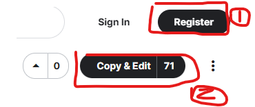
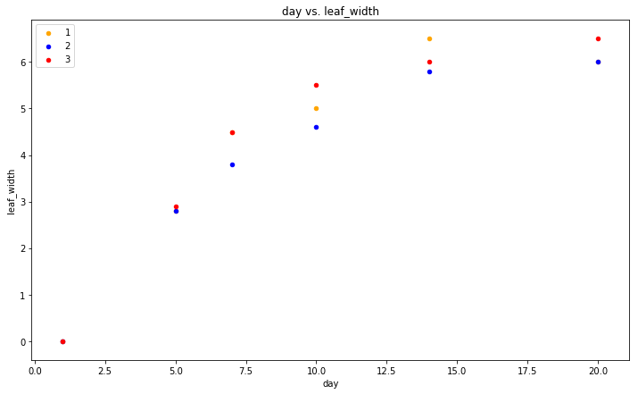

# 인공지능 시작하기

- 기본적인 csv 파일 작성방법

```python
day,heigh,leaf_width,leaf_lenth,owner
1,0,0,0,1
1,0,0,0,2
1,0,0,0,3
```

 

- 파이썬 pandas 라이브러리를 이용해 csv파일 사용하는방법

```python
import pandas as pd
data_f = pd.read_csv('plant_diary.csv')
plot(data_f.'날짜','잎너비','주인') //x,y, 색깔비교
```

- 불러온 csv 데이터는 data_f에 담기게 되고 plot  함수를 통해 data_f의 컬럼에 따른 값을 받아서 그래프를 출력할 수 있다.


### 캐글(kaggle)소개

- 데이터 분석 등의 데이터 사이언스, 엔지니어링을 하는사람에게 필수적인 사이트
- https://www.kaggle.com


### 캐글(kaggle)문서링크

- 수업의 진행은 아래의 캐글 문서를 참고하여  진행됨
- https://www.kaggle.com/yungbyun/
- https://www.kaggle.com/code/yungbyun/plant-diary-original-simple


**캐글 회원가입, 코드 클론, 수정 하는 방법**

|  |  |
| ------------------------------------ | ---------------------------------------- |

1. 상단 오른쪽 Register를 눌러 회원가입, 로그인을 진행
2. Copy & Edit 버튼을 눌러 자신의 캐글로 코드를 불러와 코드를 수정하고 실행할 수 있다.


## 시각화 코드 예제 이해하기


### csv 파일 로드

```python
import pandas as pd # 데이터 처리 모듈
import os
for dirname, _, filenames in os.walk('/kaggle/input'):
    for filename in filenames:
        print(os.path.join(dirname, filename))
data_f = pd.read_csv('../input/plant-diary-new/plant_diary_new.csv')
```


### plot, violinplot 시각화 함수 이해

```python
import matplotlib.pyplot as plt # 데이터 시각화 모듈 
import seaborn as sns # 데이터 시각화 모듈
```

- 모듈 임포트

  

```python
# 읽어온 데이터 표시하기

cl = data_f['owner'].unique()
col = ['orange', 'blue', 'red', 'yellow', 'black', 'brown']

fig = data_f[data_f['owner'] == cl[0]].plot(kind='scatter', x='day', y='leaf_width', color=col[0], label=cl[0])

for i in range(len(cl)-1):
    data_f[data_f['owner'] == cl[i+1]].plot(kind='scatter', x='day', y='leaf_width', color=col[i+1], label=cl[i+1], ax=fig)

fig.set_xlabel('day')
fig.set_ylabel('leaf_width')
fig.set_title('day' + " vs. " + 'leaf_width')
fig=plt.gcf()
fig.set_size_inches(12, 7)
plt.show()
```



- plot 시각화

```python
plt.figure(figsize=(5,4))
plt.subplot(1,1,1)
sns.violinplot(x='owner',y='leaf_length',data=data_f)
```


- violinplot 시각화
    - 시각화된 데이터를 통해 대략적인 잎의 길이의 크기분포를 알 수 있다.
    
      

> 요약 : 캐글(kaggle)의 사용법, 캐글에 있는 기존 문서를 가져와 수정하는 방법
csv 파일작성과 pandas 라이브러리를 통한 임포트 방법 
plot, violoin 함수를 통한 데이터 시각화와 시각화된 자료분석