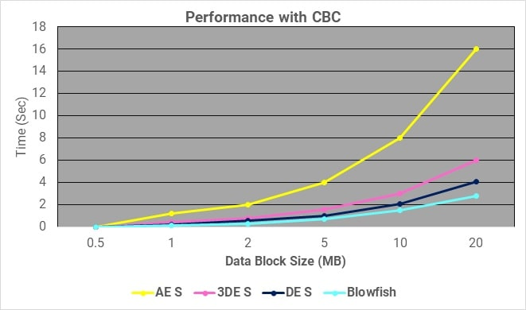
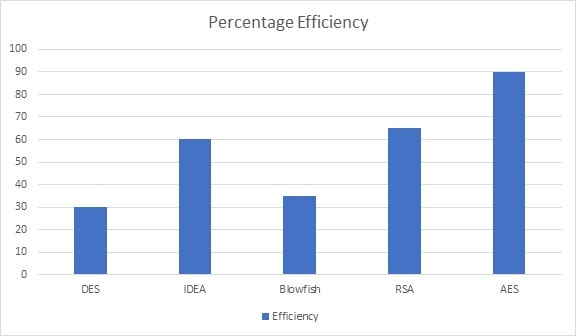

# AES 암호화 성능분석

### CBC(암호 블록체인 모드) 기준 성능 비교

### 암호화 기법에 따른 성능 비교표

| 내용 | RSA | DES | 3DES | AES |
| --- | --- | --- | --- | --- |
| 제작일, 제작자 | 1978, Ron Rivest, Adi Shamir, Leonard Adelman | 1975, IBM | 1978, IBM | 2001, Vincent Rijmen, Joan Daemen |
| 키 길이 | 모듈러스 n의 비트 수에 따라 다름, n = p*q | 56비트 | 168비트(k1, k2, k3) | 128, 192, 256 |
| 라운드 수 | 1 | 16 | 48 | 128비트 - 10
192비트 - 12
256비트 -14 |
| 블록 사이즈 | 변하기 쉬움 | 64비트 | 64비트 | 128비트 |
| 칩셋 타입 | 비대칭 블록 암호 | 대칭 블록 암호 | 대칭 블록 암호 | 대칭 블록 암호 |
| 속도 | 가장 느림 | 느림 | 아주 느림 | 빠름 |
| 보안성 | 낮음 | 충분히 좋지 않음 | 적절함 | 우수한 보안 |

### 성능 분석표를 기준으로한 2022년 기준 효과적인 암호화 기법

- CPU 암호화 복호화 속도

- 키 생성 비율

- 키 크기

- 암호화 프로세스에서 데이터를 보유하는 데 필요한 메모리 양

- 모델이 수용할 수 있는 사용자 수

- 키 실패 시 데이터를 복구하는데 필요한 시간

- 공겨가가 공격을 생성하는데 걸리는 시간

- 알고리즘의 복잡성

  

> 위 사항을 섞어서 Encryption Consulting 이 직접 2022년 암호화 알고리즘별 점수를 매긴 그래프 이다
> 

### 결론

다양한 알고리즘에 대한 연구에 따르면 모델의 강도는 키 관리, 암호화 유형, 키 수, 키에 사용된 비트 수에 따라 다릅니다. 모든 키는 수학적 속성을 기반으로 합니다. 비트 수가 더 많은 키에는 더 많은 계산 시간이 필요하며, 이는 시스템이 데이터를 암호화하는 데 더 많은 시간이 걸린다는 것을 나타냅니다. AES 데이터 암호화는 수학적으로 더 효율적이고 우아한 암호화 알고리즘이지만 주요 장점은 다양한 키 길이에 대한 옵션입니다. AES를 사용하면 128비트, 192비트 또는 256비트 키를 선택할 수 있어 기하급수적으로 강력합니다. AES는 암호화된 블록을 생성하기 위해 일련의 대체 및 순열 단계를 포함하는 순열-대체를 사용합니다.

2022년 기준 AES 알고리즘은 아직 유효하며 이전 128비트 키값이 아닌 192 비트 이상의 키값을 권장하고 있습니다.

### 참고

Encryption Consulting[암호화 컨설팅] : [https://www.encryptionconsulting.com/comparison-of-various-encryption-algorithms-and-techniques-for-securing-data/](https://www.encryptionconsulting.com/comparison-of-various-encryption-algorithms-and-techniques-for-securing-data/)