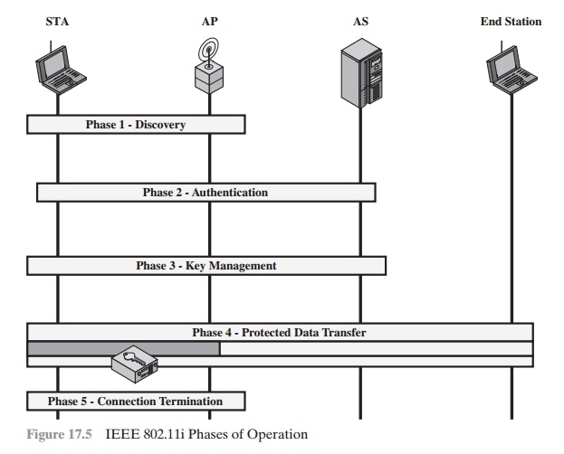

# 키공유 방식

- IEEE 802.11 네트워크 환경에선 암호화 되지 않은 상태로 통신이 가능하고, 64비트, 128비트의 WEP 암호화를 사용해 보안성을 높일 수 도 있다. 현재에선 WEP 자체에 구조적 취약점이 있기  때문에 잘쓰지이지 않게 되어, WPA, WPA2 등의 보안을 사용한다.

## IEEE 802.11i 무선랜 서비스 보안 제공방식

IEEE 802.11i 운영단계

- **Discovery**
    - AP는 비콘, 프로브 응답 등의 메시지를 이용하여 IEEE 802.11i 보안 정책을 알림, STA 에선 이를 사용하여 통신하려는 WLAN의 AP를 식별함. STA는 비콘, 프로브 응답을 받고 정책이 지원하는지에 따라 인증 메커니즘을 선택, AP와 연결함.
- **Authentication**
    - STA와 AS는 서로의 ID를 증명, AP는 인증 트랜잭션이 성공할때까지 STA와 AS간의 비인증 트래픽을 차단함. AP는 STA 와 AS 간의 트래픽 전달 외에는 인증 트랜잭션에 참여하지 않음
- **Key generation and distribution**
    - AP와 STA간 암호화 키가 생성, AP와 STA에 배치 생성된 프레임으 AP와 STA 사이에서만 교환함
- **Protected data transfer**
    - 프레임은 AP를 통해 STA와 종단국 간에 교환됨, 보안 데이터 전송은 이미지와 같이 STA와 AP 사이에서만 발생, 종단간 에서는 보안이 제공되지 않음
- **Connection termination**
    - AP와 STA 간 프레임 교환이 이루어지며, 이 단계에서는 보안 연결이 해제되고 보안연결이 해제되고 원래 상태로 됨

- IEEE 802.11i 에서의 인증방식
    - PSK 방식
        - 별도의 인증서버가 필요없음, 대신에 무선단말, AP 간에 사전 키 공유가 필요함
        - 통상적으로 256비트 길이의 사용자/관리자 가 입력한 암호, SSID를 기반으로 생성
        - 무선단말, AP 사이에서 인증메시지를 직접주고받음
        - 무선단말과 AP에 동일한 PSK를 세팅되고, 정적인 PMK로부터 무선구간 세션 암호화 키가 유도됨
    - 802.1/EAP 방식
        - 사용자 인증, 키교환을 위해 별도 인증서버 필요
        - 실제 인증 수행은 주로 EAP 인증 프레임워크 상에서 이루어짐

### 참고문서

- [https://www.brainkart.com/article/IEEE-802-11i-Wireless-LAN-Security_8486/](https://www.brainkart.com/article/IEEE-802-11i-Wireless-LAN-Security_8486/)
- [https://ko.wikipedia.org/wiki/IEEE_802.11#보안](https://ko.wikipedia.org/wiki/IEEE_802.11#%EB%B3%B4%EC%95%88)
- [https://itwiki.kr/w/IEEE_802.11i](https://itwiki.kr/w/IEEE_802.11i)