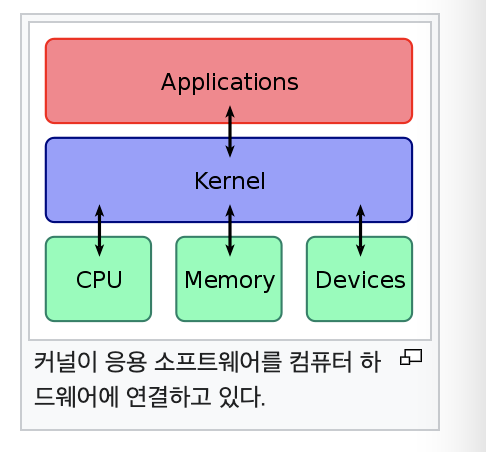

## 운영체제의 구조

### 커널과 인터페이스

- 커널(Kernel)
    - 프로세스 관리, 메모리 관리 저장장치 관리와 같은 운영체제의 핵심적인 기능을 모아 놓은 것
    - 장치 제어시, 드라이버를 경유한다
- 인터페이스(Interface)
    - 커널에 사용자의 명령을 전달하고 실행 결과를 사용자에게 알려주는 역할
    - 애플리케이션 부분에서 작동

<aside>
💡 운영체제에서의 기본 모든 동작은 안정성을 위해 인터페이스를 통해 동작한다

- 시스템 호출 (System Call)
    - 커널이 자신을 보호하기 위해 만든 인터페이스
    - 커널 접근시 운영체제가 제공한 서비스에 대한 프로그래밍 인터페이스(함수)
    - 사용자와 응용프로그램은 컴퓨터 자원을 보호하기 위해 시스템 호출을 경유하지 않으면 커널에 직접 접근이 불가능하다
    - 커널과 애플리케이션 영역 사이에서 동작

<aside>
💡 직접접근과 시스템 호출을 경유한 커널 접근은, 커피를 직접 타먹는 경우 와, 커피를 전문으로 타는 사람에게 부탁하는 경우의 차이이다.

시스템 호출 정리

- 시스템 호출을 커널이 제공하는 시스템 자원의 사용과 관련된 **함수**
- 응용 프로그램이 하드웨어 자원에 접근하거나 운영체제가 제공하는 서비스를 이용하려 할 때는 시스템 호출을 이용해야함
- 운영체제는 커널이 제공하는 서비스를 시스템 호출로 제한하고 다른 방법으로 커널에 들어오지 못하게 함으로서 안정성을 확보

- 드라이버
    - 커널과 하드웨어의 인터페이스 역할을 하는 것
    - 커널에서 하드웨어로 직접 접근하지 않고 드라이버를 경유해 접근한다

### 커널의 구성

- 프로세스 관리
    - 프로세스에 CPU를 배분, 작업이 필요한 환경 제공
- 메모리 관리
    - 프로세스에 작업 공간을 배치하고 실제 메모리보다 큰 가상공간을 제공
- 파일 시스템 관리
    - 데이터를 저장하고 접근할 수 있는 인터페이스 제공
- 입출력 관리
    - 필요한 입력과 출력 서비스를 제공
- 프로세스 간 통신 관리
    - 공동 작업을 하는 프로세스간 통신 환경을 지원

### 커널 구조

- 단일 구조형 커널
    - 장점
        - 모듈분리가 되지않아 모듈간 통신 비용이 줄어들어 효율적 운영이 가능
        - main 함수에 모든 기능을 넣는것과 비슷
    - 단점
        - 모든 모듈이 하나로 묶여 있기때문에 버그나 오류를 처리하기 어려움
        - 모든 기능이 서로 연결되어 있기 때문에 작은 결함이 시스템 전체로 확산될 수 있음
- 계층형 구조 커널
    - 단일 구죠형이 발전된 형태, 비슷한 기능의 모듈들 끼리 묶어서 하나의 계층을 만들고 각 계층간 통신을 통해 운영체제를 구현 하는 방식
- 마이크로 구조 커널
    - 프로세스 관리, 메모리 관리, 프로세스 간 통신 관리등 가장 기본적인 기능만 제공
- 가상머신
    - 운영체제와 응용프로그램 사이에서 작동하는 프로그램
    - 가상머신을 설치하면 응용 프로그램이 모두 동일한 환경에서 작동하는 것처럼 보임
    - 예) 자바 가상머신

### 유닉스와 리눅스

- 유닉스의 개발과 확산
    - 1960년대의 유닉스 개발
    - 1969년 AT&T의 연구원으로 멀틱스 프로젝트에 참가 중이던 켐 톰프슨이 사무실에서 안쓰던 PDP-7 컴퓨터에 멀틱스와 비슷한 개념의 운영체제를 구현 하려 함
    - 멀틱스 프로젝트가 잘 딘행되지 않던 차에 톰프슨의 행동에 흥미를 느낀 데니스 리치와 피터 뉴만도 이것에 참여하게 되어, 이 운영체제의 이름을 골치아픈 멀틱스 대신 단순하다는 의미의 유닉스로 명하여 완성하게 됨
    - 유닉스는 이식하기 쉬웠던 탓에 금방 인기를 얻게됨
    - 개발 후 소스코드가 공개되어 계속 다른 기종의 컴퓨터에 이식되었으며 여러 기업과 대학에서 이를 이용한 연구가 진행되어 다양한 기능이 추가됨

- 리눅스의 개발
    - 1991년 리누스 토르발스가 PC에서 동작하는 UNIX 호환 커널을 작성하여 GPL 라이선스로 배포하고, 이어서 소스 코드도 공개한 것이 리눅스의 시작
    
- 애플 II 의 등장
    - 1976년 스티브 잡스는 스티브 워즈니악, 로널드 웨인과 함께 애플을 창업하고
    - 1977년 애플 II 라는 개인용 컴퓨터를 대중화 함

- 스티브 잡스의 업적
    - 기술을 발전시키는 것 보다 사용자에게 편리함을 제공하는 사용자 인터페이스와 같은 기술 개발에 집
    - 사용자 인터페이스 보다 더 사용자 친화적이고 사용자 경험에 중심을 두는 UX 기술 개발에 집중
    - 2001년 iPod을 출시하여 음악 산업 전체를 뒤집음
    - iPod 다음으로 iPhone을 내놓아 세상을 놀라게 함

- 윈도우 출시
    - 마이크로소프트는 애플 MAC OS의 그래픽 사용자 인터페이스에 자극을 받아 윈도우 운영체제를 출시하고 계속 업그레이드하여 현재는 버전 10 까지 나옴

- 스마트폰의 등장
    - 마이크로소프트의 번영은 스마트폰의 등장으로 한풀 꺾임
    - 애플의 아이폰이 스마트폰 시장을 장악
    - 다른 회사들도 그에 대항할 스맡폰을 개발하는데 주력
    - 구글이 모바일용 운영체제인 안드로이드를 개발
    - 현재 아이폰을 제외한 대부분의 스마트폰은 안드로이드를 사용

- 안드로이드의 특징
    - GNU의 리눅스 커널을 사용하여 제작되었기 때문에 GPL 라이선스를 따름
    - 누구나 공짜로 사용이 가능, 새로운 버전과 동시에 소스코드도 공개하기 때문에 수정, 배포가 가능
    - 스마트폰 제조사들은 대부분 안드로이드의 소스코드를 자사 제품에 맞게 수정하여 무료로 배포하고 있음